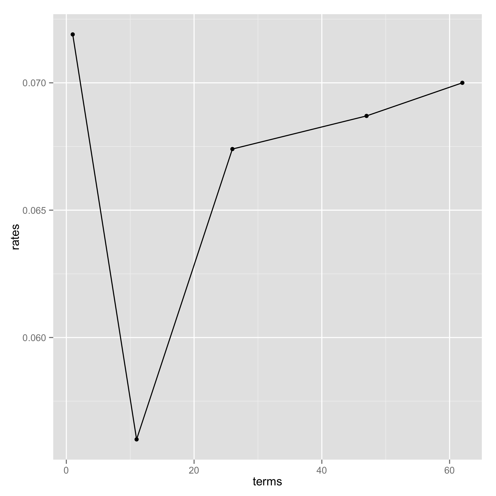

# fixedincome

Calculations involving interest rates are usually very easy and straightforward, but sometimes it involves specific issues regarding compounding and day counting rules that make it annoying.
The `fixedincome` package brings many functions to create and handle with interest rates and term structure of interest rates.

Below there are a few examples on how to create and make calculations with interest rates using `fixedincome`.

## Examples

Let's declare an annual spot rate with a `simple` compounding, an `actual/360` day count which stands for current days between two dates and 360 days per year and an `actual` calendar.

```r
sr <- spotrate(0.06, 'simple', 'actual/360', 'actual')
sr
# simple actual/360 actual 
# 0.06 
```

Compound the spot rate for 7 months.

```r
> compound(sr, 7, 'months')
# [1] 1.035
```

Spot rates can be created using a string representation

```r
as.spotrate('0.06 discrete actual/365 actual')
# 0.06 discrete actual/365
```

### Spot rate curves

Let's create a spot rate curve.

```r
curve <- spotratecurve(c(1, 11, 26, 47, 62),
                       c(0.0719, 0.056, 0.0674, 0.0687, 0.07),
                       compounding='simple', daycount='actual/365',
                       units='days', name='TS')
curve
##             TS
##  1 days 0.0719
## 11 days 0.0560
## 26 days 0.0674
## 47 days 0.0687
## 62 days 0.0700
## simple actual/365 
```

```{r}
require(ggplot2)
ggplot(data=as.data.frame(curve), aes(x=terms, y=rates)) + geom_line() + geom_point()
```




